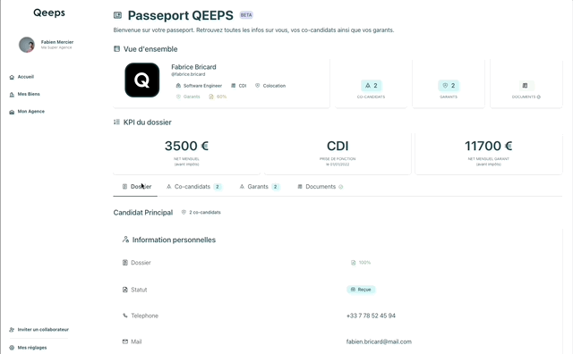
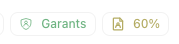

<p style="text-align: center">

# Summary

The application displays a dashboard with candidate information including guarantors for real estate agents managing rental properties. It includes all the basic KPIs and a basic navigation menu through tabs that the agents can access.

## Technologies used

**Backend**: `Nodejs`, `Express`and `MongoDB`

**Frontend**: `React` ,`Typescript` , `ChakraUI`

## Sample test run



## Installation

From the root of the project:

1. Install the backend:

   `cd qeeps_test_application/backend && npm i`

1. Install the frontend:

   `cd qeeps_test_application/backend && npm i`

## Running the application

1. Update the environment variables for both the backend and the frontend in the respective .env files

1. Seed the database from the **backend folder**:

   `npm run db:reset`

1. Launch the backend from the **backend folder**:

   `npm run dev`

1. Launch the frontend from the **frontend folder**:

   For the development server:

   `npm start`

   Or create the latest build and serve locally:

   ```bash
   cd frontend && npm start
   npm install -g serve
   serve -s build -l 4000
   ```

## Running the tests

From within the backend or the frontend folder in the application:

`npm test`

## Backend

### Architecture

<details>
<summary>Click to expand</summary>

The backend of the application was created with scalability in mind using a modular architecture.

A model agnostic controller allows for additional models to be added, and a seamless scaling up of the routes separated in individual routers grouped in the `router.index.ts` file.

</details>

### Data models

<details>
<summary>Click to expand</summary>

The models were created based on the requirements in the project description and the additional information gathered from the Figma design. Mongoose was used for the creation of the models to ensure strict Schema enforcement required for applications dealing with contracts and financial information. Mongoose was also used for connecting to a remote MongoDB Atlas database.

Candidate model:

```tsx
export const CandidateSchema = new Schema({
  type: { type: String, required: true },
  firstName: { type: String, required: true },
  lastName: { type: String, required: true },
  phoneNumber: { type: String, required: true },
  email: { type: String, required: true, unique: true },
  dateOfBirth: { type: Date, required: true },
  address: { type: String, required: true },
  monthlyJobRevenues: { type: Number, required: true },
  otherRevenues: { type: Number, default: 0 },
  otherRevenuesType: { type: String, default: "" },
  job: { type: String, required: true },
  contractType: { type: String, required: true },
  situation: { type: String, required: true },
  guarantorIds: [{ type: Schema.Types.ObjectId, ref: "Guarantor" }],
  coCandidates: [{ type: String }],
  workingSince: { type: Date },
});
```

Guarantor model:

```tsx
export const GuarantorSchema = new Schema({
  firstName: { type: String, required: true },
  phoneNumber: { type: String, required: true },
  lastName: { type: String, required: true },
  email: { type: String, required: true, unique: true },
  dateOfBirth: { type: Date, required: true },
  address: { type: String, required: true },
  monthlyJobRevenues: { type: Number, required: true },
  otherRevenues: { type: Number, required: true },
  otherRevenuesType: { type: String, required: true },
  job: { type: String, required: true },
  contractType: { type: String, required: true },
  workingSince: { type: Date, required: true },
});
```

Seed data can be found in the seed_data folder within the backend part of the application and the database can be reset by running `npm run db:reset` after updating the mongoDB URI in the .env file.

_Note for further development: Based on my understanding of the business logic a third table “Application” (or Dossier/Candidature) is recommended. It should include relationships between Candidates and Guarantors in relation to a specific rental property since a candidate could be applying to various properties._

</details>

### Error handling

<details>
<summary>Click to expand</summary>

A custom error class extends the base Error class and handles all the error instances.

```tsx
export enum HttpCode {
  OK = 200,
  NO_CONTENT = 204,
  BAD_REQUEST = 400,
  UNAUTHORIZED = 401,
  NOT_FOUND = 404,
  INTERNAL_SERVER_ERROR = 500,
}

interface AppErrorArgs {
  name?: string;
  httpCode: HttpCode;
  description: string;
  isOperational?: boolean;
}

export class ApiError extends Error {
  public readonly name: string;
  public readonly httpCode: HttpCode;
  public readonly isOperational: boolean = true;

  constructor(args: AppErrorArgs) {
    super(args.description);

    Object.setPrototypeOf(this, new.target.prototype);

    this.name = args.name || "Error";
    this.httpCode = args.httpCode;

    if (args.isOperational !== undefined) {
      this.isOperational = args.isOperational;
    }

    Error.captureStackTrace(this);
  }
}
```

In order to avoid repetitive code, a middleware wraps the controller in a try/catch block at every API call.

```tsx
import { ApiError, HttpCode } from "../errors/api.error";
import { Request, Response, NextFunction, request } from "express";

export type Controller = (
  req: Request,
  res: Response,
  next: NextFunction
) => void;

export default (controller: Controller) =>
  (req: Request, res: Response, next: NextFunction) => {
    try {
      controller(req, res, next);
    } catch (err: unknown | Error | ApiError) {
      if (err instanceof Error || err instanceof ApiError) {
        next(
          new ApiError({
            description: err.message,
            httpCode: HttpCode.INTERNAL_SERVER_ERROR,
          })
        );
      } else {
      }
      next(
        new ApiError({
          description: "Something went wrong",
          httpCode: HttpCode.INTERNAL_SERVER_ERROR,
        })
      );
    }
  };
```

</details>

## Frontend

### Styles

- Custom theming:
  The colour scheme provided in the Figma file is included in a Chakra UI as a theme extension in the `theme.ts` file
- In order to facilitate fast development and code review for this kind of exercise, as well as in order to take advantage of Chakra UI’s styled components, inline styling was preferred.
- For the icons, chakraUI’s `createIcon` was used based on the SVGs generated by Figma to ensure that the icons generated would match the design. Their `fill` and `stroke` were reset so that they can be dynamically generated based on the data flow on the page like this:

<p style="text-align: center"></p>

### Data flow

- The sidebar component has been rendered statically and the candidate and guarantor data are fetched by the Main component following React’s single source of truth principle.
- In order to simulate values like a folder’s completion rate (”Documents”) example data was hardcoded for the demo. In other cases, the colour of certain tags was calculated based on the seed data such as the numbers of guarantors or that of co-candidates.

</p>
